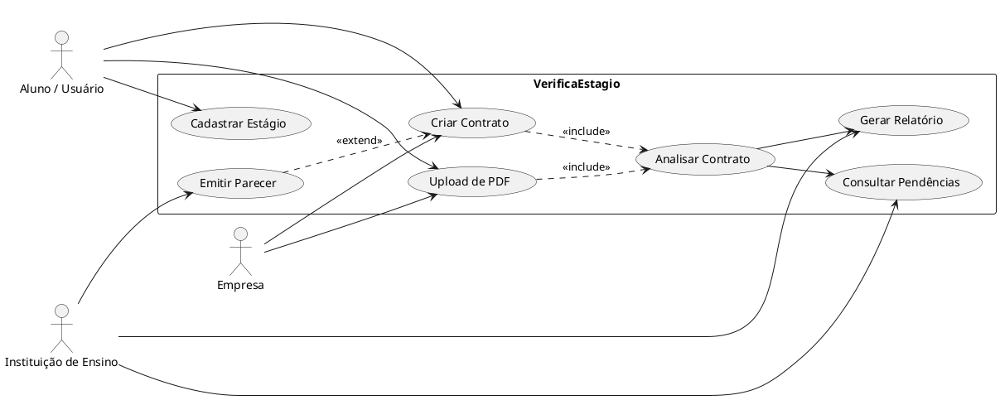

## Casos de uso principais

### 1. Cadastrar estágio
- Atores: Aluno, Empresa, Instituição
- Descrição: o estágio é registrado com dados de curso, carga horária, supervisor, professor orientador e seguro.
- Resultado esperado: estágio existente no sistema e pronto para associação ao contrato.

### 2. Submeter contrato
- Atores: Aluno, Empresa
- Descrição: o contrato é criado e vinculado ao estágio e à instituição.
- Resultado esperado: contrato com status RECEBIDO disponível na API.

### 3. Upload de contrato em PDF
- Atores: Aluno, Empresa
- Descrição: o arquivo PDF do contrato é enviado ao sistema.
- Resultado esperado: arquivo aceito apenas se for PDF e vinculado ao contrato.

### 4. Analisar contrato
- Atores: Sistema
- Descrição: o backend executa validações de regras de estágio, gera pendências e atualiza o status do contrato.
- Resultado esperado: análise criada com resultado APROVADO, PENDENTE ou REPROVADO.

### 5. Consultar pendências e relatórios
- Atores: Aluno, Empresa, Instituição
- Descrição: os resultados da análise são disponibilizados com pendências detalhadas e relatório de conformidade.
- Resultado esperado: pendências listadas e relatório associadas à análise.

### 6. Emitir parecer institucional
- Atores: Instituição de ensino
- Descrição: a instituição registra um parecer final sobre o contrato.
- Resultado esperado: contrato recebe status APROVADO_FINAL ou INVALIDO_PENDENTE.

## Diagrama de casos de uso

## Alinhamento com o backend atual
- Endpoints disponíveis: `/api/estagios/`, `/api/contratos/`, `/api/analises/`, `/api/pendencias/`, `/api/relatorios/`, `/api/pareceres/`.
- Autenticação: registro, login e logout via sessão.
- O sistema atual não implementa interface gráfica nem envio automático de notificações.

