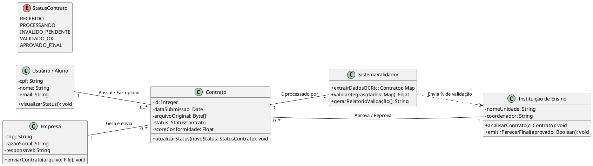

## Diagrama de classes

### Diagrama:

```plantuml
@startuml
skinparam classAttributeIconSize 0
left to right direction

' Classes Principais
class "Usuário / Aluno" as Usuario {
  - cpf: String
  - nome: String
  - email: String
  + visualizarStatus(): void
}

class Empresa {
  - cnpj: String
  - razaoSocial: String
  - responsavel: String
  + enviarContrato(arquivo: File): void
}

class Contrato {
  - id: Integer
  - dataSubmissao: Date
  - arquivoOriginal: Byte[]
  - status: StatusContrato
  - scoreConformidade: Float
  + atualizarStatus(novoStatus: StatusContrato): void
}

class SistemaValidador {
  + extrairDadosOCR(c: Contrato): Map
  + validarRegras(dados: Map): Float
  + gerarRelatorioValidação(): String
}

class "Instituição de Ensino" as Instituicao {
  - nomeUnidade: String
  - coordenador: String
  + analisarContrato(c: Contrato): void
  + emitirParecerFinal(aprovado: Boolean): void
}

enum StatusContrato {
  RECEBIDO
  PROCESSANDO
  INVALIDO_PENDENTE
  VALIDADO_OK
  APROVADO_FINAL
}

' Relacionamentos
Empresa "1" -- "0..*" Contrato : "Gera e envia"
Usuario "1" -- "0..*" Contrato : "Possui / Faz upload"
Contrato "1" -- "1" SistemaValidador : "É processado por"
SistemaValidador ..> Instituicao : "Envia % de validação"
Instituicao "1" -- "0..*" Contrato : "Aprova / Reprova"

@enduml
```