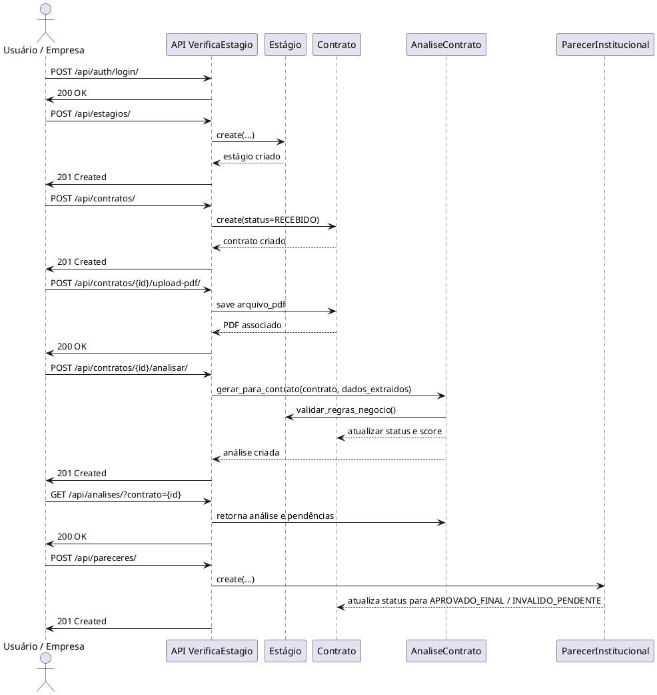

## Fluxo de execução do contrato

### Visão geral
Este diagrama descreve o fluxo atual implementado no backend VerificaEstagio: autenticação, cadastro de estágio, submissão de contrato, upload de PDF, análise automática e emissão de parecer institucional.

### Diagrama de sequência

### Observações
- A análise gera pendências a partir do estágio associado ao contrato.
- `AnaliseContrato.gerar_para_contrato()` recalcula resultado e cria o relatório de conformidade.
- O parecer institucional atualiza o status do contrato para APROVADO_FINAL quando aprovado.

