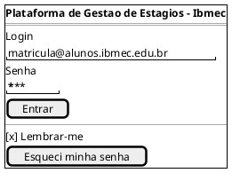
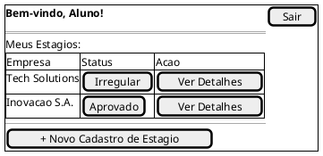
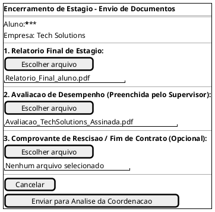
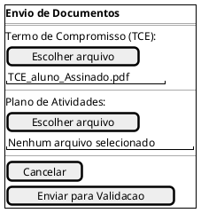
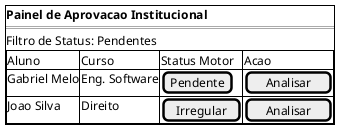
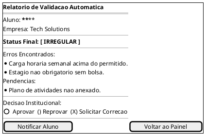

## Introdução

A construção do protótipo de alta fidelidade auxilia a equipe de desenvolvimento a encontrar um nível de detalhes abrangentes, extrair funcionalidades, testar usabilidade, e também fornece uma base para o gerenciamento do projeto pois com o protótipo é possível realizar estimativas de quanto tempo será necessário desempenhar em cada funcionalidade.

## Metodologia

Iniciamos o projeto através dos levantamentos iniciais da equipe, após discussões a ferramenta Figma foi selecionada para produzir o protótipo de alta fidelidade com auxílio do Material Design Color Tool.

## Protótipo de baixa fidelidade

### Versão 1.0

### Tela Login

### Dashboard do Aluno

### Tela de Cadastro de Dados do Estágio

### Tela de Envio de Documentos (Upload)

### Visão da Instituição (Painel da Coordenação)

### Relatório de Validação (Resultado do Motor)

## Conclusão

A partir da elaboração do protótipo foi possível ter uma noção inicial da interface do usuário, definindo fluxo, paleta de cores, botões, app bars e diversas outras funcionalidades

## Referências

> Ferramenta PlantUML. Disponível em (https://plantuml.com/salt)

## Autor(es)

| Data | Versão | Descrição | Autor(es) |
| -- | -- | -- | -- |
| 16/04/2026 | 1.0 | Criação do documento | Gabriel Melo,Bernardo Brandão,Iago Viana,Pedro Dos Santos e Gabriel m| 
